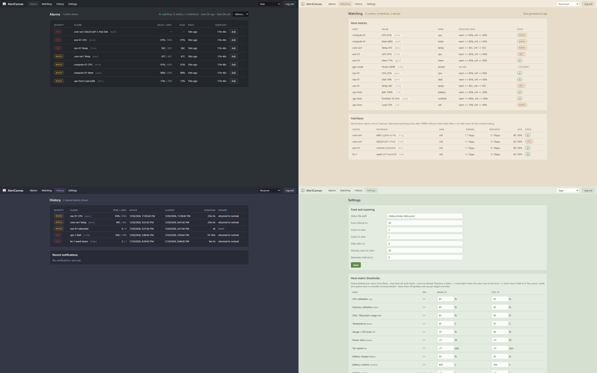

# AlertCanvas - Basic Threshold Alerting

> A lightweight, self-hostable alerting companion for home labs and small
> networks: watch the values SNMPCanvas exports, hold them against your
> thresholds, and get an email, push, or syslog message when one crosses -
> and again when it recovers.

AlertCanvas alerts only on values you have explicitly chosen to export from
SNMPCanvas. That keeps it tiny: no per-vendor MIB knowledge, no discovery,
no agents - just the numbers you already decided matter, a threshold for
each kind, and a notification when one crosses. It is part of the Canvas
family: [**CrossCanvas**](https://github.com/RootSwitch/CrossCanvas) draws
your network, [**PingCanvas**](https://github.com/RootSwitch/PingCanvas)
turns those diagrams into a live reachability wall,
[**SNMPCanvas**](https://github.com/RootSwitch/SNMPCanvas) gathers the
performance history and exports chosen values to `snmp-status.json`,
[**SyslogCanvas**](https://github.com/RootSwitch/SyslogCanvas) remembers
what your devices said,
[**LaunchCanvas**](https://github.com/RootSwitch/LaunchCanvas) signs you
into all of them at once - and AlertCanvas is the one that taps you on the
shoulder.

**Install the whole suite in one command:** the [canvas-suite](https://github.com/RootSwitch/canvas-suite) repo is the family's landing page, with one-shot install scripts for the full six-app stack or a Pi-class PingCanvas + AlertCanvas pair.

The family's small-footprint ethos carries over: one container, one SQLite
file, two runtime dependencies, and a frontend that is plain HTML/CSS/JS
with no build step.



## How it works

```
SNMPCanvas ──► snmp-status.json ──► AlertCanvas ──► email / ntfy / syslog
                     │                   │
                     └──► PingCanvas     └──► alarms, history & web UI
```

One Node process does everything: a scanner reads the feed on an interval,
holds every exported value against your thresholds, walks alarms through an
anti-flap state machine in SQLite, and the same process serves the UI and
sends the notifications. SNMPCanvas keeps collecting, PingCanvas keeps
displaying; AlertCanvas only ever reads the file they share.

## Features

- **Raise and clear notifications** with anti-flap confirmation (N
  consecutive scans to raise, N to clear), warn/crit severities, and
  one-per-incident escalation - severity and the crossed threshold stick at
  the incident's worst, so a value bouncing on the crit line can't spam you.
- **Email (SMTP)** - STARTTLS / implicit TLS / plaintext, auth, a test
  button, and failed sends retried with backoff and surfaced in the UI.
- **Syslog (RFC 5424 over UDP)** - lands first-class in
  [SyslogCanvas](https://github.com/RootSwitch/SyslogCanvas) or any
  receiver, with structured data carrying host/kind/severity/code.
- **ntfy push** - point it at [ntfy.sh](https://ntfy.sh) or a self-hosted
  server for phone notifications; crit pushes as urgent priority, warn as
  high.
- **Watching page** - every exported value with the rule that applies to it
  and where that rule came from (default, override, or muted), so
  misconfiguration is visible instead of silent.
- **Per-target overrides** - a different limit for one hot-running sensor,
  or a mute for a noisy port, keyed by the feed's stable codes.
- **Stale-feed watchdog** - if SNMPCanvas stops writing, that is itself a
  crit alarm; so is a feed the scanner cannot read or parse.
- **Reboot detection** - an exported uptime value going backwards raises a
  one-shot "host rebooted" event, with no meaningless clear afterwards.
- **Test alarm** - fire a synthetic alarm through the real pipeline
  (templates, every enabled channel, raise then clear) so you know what the
  2 AM email will look like before 2 AM does.
- **Maintenance silence** - suppress notifications for 1 hour to 7 days
  while alarms keep tracking; suppressed sends are logged, and the window
  is bounded so it cannot be forgotten.
- **Status in the browser tab** - the title carries the raised-alarm count
  and the favicon's canvas washes amber or red, so a pinned tab reads at a
  glance.
- **Alert formatting** - editable subject/body/syslog templates with
  `{{variable}}` substitution and a built-in reference table.
- **Single shared password** for the UI (scrypt-hashed), sessions, login
  rate limiting, and one-click database backups from the Settings page.
- **30 themes** - Classic plus 29 shared with CrossCanvas's palette family, grouped the
  same way (Paper / Warm / Cool / Night / Screen).

## Small on purpose

AlertCanvas is intentionally a threshold engine with a clear window onto
it: scan, compare, notify, remember. Per-severity recipient routing, HTML
mail, alert correlation, dashboards, and auto-remediation aren't on the
roadmap - they are jobs for bigger systems, and the reason this app exists
is that those systems are overkill for a homelab. Keeping the moving parts
few is a design choice - and if you want it to become something bigger, the
license makes forking genuinely easy.

## Quick start (Docker)

> **Installed via the [canvas-suite](https://github.com/RootSwitch/canvas-suite)
> script?** Skip this section - your data lives under
> `/srv/noc-data/alertcanvas`, the override (feed mount, ALERTCANVAS_SECRET,
> SUITE_SECRET) is already written, and the app is running. Just set the
> admin password on first visit.
>
> **Running the PingCanvas + AlertCanvas pair** (the `canvas-wall-setup.sh`
> deployment, no SNMPCanvas)? That mode sets `STATUS_FILE=off` - the SNMP
> feed and its watchdog are disabled on purpose, and alerting comes from
> the ping opt-ins on the Watching page. The SNMP-first steps below do not
> apply; see "Ping alerting" further down.

```yaml
# docker-compose.yml (in the repo; abridged)
services:
  alertcanvas:
    build: .        # or a published image once available
    ports: ["9162:9162"]
    volumes:
      - ./data:/data:z                      # SQLite db + certs
      - ../snmpcanvas/data:/status:ro,z     # SNMPCanvas's data dir, read-only
    restart: unless-stopped
```

```
git clone https://github.com/RootSwitch/AlertCanvas.git
cd AlertCanvas
mkdir -p data && sudo chown 1000:1000 data   # container runs as uid 1000
# point the feed mount at YOUR SNMPCanvas data dir via an override file:
cat > docker-compose.override.yml <<'EOF'
services:
  alertcanvas:
    volumes:
      - /srv/noc-data:/status:ro,z
EOF
docker compose up -d --build
```

Open `http://your-host:9162`, set the admin password on the first-run page,
and check the Alarms page. That's the whole install. (The default port is a
nod to SNMP's trap port UDP/162 - the notification side of SNMP - picked to
coexist quietly with common home-lab neighbors like Uptime Kuma on 3001,
CrossCanvas/PingCanvas on 8080/8443, SNMPCanvas on 9161, and SyslogCanvas
on 9514.)

Two first-run notes: the setup page belongs to whoever reaches the port
first, so on anything but a trusted segment either set `ADMIN_PASSWORD` in
the override file or claim the page immediately after `up -d`. And if the
feed mount is wrong you'll know within a couple of minutes - the stale-feed
watchdog raises, which doubles as proof that alerting works.

Then, under Settings: **Email** (SMTP server, from/to, Send test email),
optionally **Syslog** and **ntfy push**, and **Thresholds** - the defaults
are sane for a homelab; adjust to taste and add per-target overrides for
the odd sensor that runs hot.

### HTTPS

Run the included script once on the docker host, then restart:

```
./tools/gen-cert.sh 192.168.1.50 nas.lan    # your host's IPs / names
docker compose restart
```

It writes a self-signed cert to `data/certs/server.crt` + `server.key`; the
server detects the pair at startup and switches to HTTPS on the same port
(session cookies become `Secure` automatically). Prefer a real certificate?
Place your own PEM pair at those two paths (or point `TLS_CERT`/`TLS_KEY`
elsewhere) - nothing else changes. Delete the files to fall back to HTTP.
If HTTPS doesn't come up, the pair usually isn't readable by uid 1000
(`sudo chown -R 1000:1000 data/certs` fixes that).

### Customizing the deployment

Put host-specific settings (volume paths, environment variables, ports) in
a `docker-compose.override.yml` next to the compose file - Docker Compose
merges it automatically (volume entries merge by container mount path), and
it's gitignored so updates never conflict with your edits:

```yaml
# docker-compose.override.yml (example)
services:
  alertcanvas:
    volumes:
      - /srv/noc-data:/status:ro,z
    environment:
      - TZ=America/Chicago
      #- ADMIN_PASSWORD=change-me
      #- ALERTCANVAS_SECRET=a-long-random-string
```

### Updating an existing install

```
git pull
sudo docker compose up -d --build
```

The data directory is a bind mount, so alarms, history, and settings ride
through every update (schema migrations run automatically on first boot).
An occasional `sudo docker image prune -f` tidies old layers.

### Running without Docker

Node 20+: `npm install && npm start` (listens on `:9162`, data in `./data`,
feed path in Settings or `STATUS_FILE`).

## What it can alert on

| Rule | Default | Direction |
|---|---|---|
| CPU / memory / disk utilization | warn 85, crit 95 (%) | >= |
| Temperature | warn 45, crit 55 (C) | >= |
| Gauge / UPS load (`util`) | warn 70, crit 90 (%) | >= |
| Battery charge | warn 50, crit 20 (%) | <= |
| Battery runtime | warn 600, crit 300 (s) | <= |
| Status alarm (`state`: UPS on battery, fault flags) | crit | >= |
| Fan rpm, power draw, meters (A/V), outlet, uptime | off (no universal number) | override-only |
| Reboot (exported uptime goes backwards) | warn, one-shot event | - |
| Interface link down (oper down while admin up) | crit | - |
| Interface errors / discards | 1/10 and 5/50 pkt/s | >= |
| Interface utilization (% of link speed) | warn 80, crit 95 | >= |
| Device down (SNMP unreachable) | crit | - |
| Ping device down (PingCanvas feed, opt-in per device) | crit | - |
| Ping device degraded (high latency) | off (opt-in warn) | - |
| Stale, missing, or unreadable status file | crit | - |

Per-kind defaults apply everywhere; overrides change or mute a single
exported value (by its stable code) or one host+kind. A down device raises
one alarm, not one per interface. Unreadable values (`null` or garbage)
freeze an alarm rather than clearing it; a value that disappears from the
feed entirely auto-clears after a configurable number of scans.

## Ping alerting: the devices SNMP can't see

Some things you monitor don't speak SNMP - your ISPs' gateways, an internet
canary, a landlord's switch. PingCanvas already pings them; AlertCanvas can
alert on them by reading the poller's combined status file
(`status-all.json`, which the suite's shared-data layout puts in the same
directory as the SNMP feed - no extra mount).

It is **opt-in per device**: the Watching page lists everything in the ping
feed with a checkbox, and only checked devices alarm (crit on down; a warn
on degraded is a separate Settings toggle). Leave devices that already have
SNMP device-down alarms unchecked, or one outage alarms twice. Each watched
device takes an optional notification label, so the 2 AM email says
`Primary ISP (fiber) ping` rather than a bare address. The ping feed gets
its own stale-feed watchdog - but only once at least one device is watched,
so an SNMP-only install never hears about a feed it doesn't use.

The rule is symmetric: set the status file path to `off` (or
`STATUS_FILE=off` in the compose file) and the SNMP feed is disabled
entirely, watchdog included. That makes a **PingCanvas + AlertCanvas pair**
a first-class lightweight deployment - a ping wall that pages you, light
enough for a Pi, with a plain JSON file as the only interconnect.

Without SNMPCanvas on the box, mount the poller's output directory itself
(e.g. `- /srv/noc-data:/status:ro,z` with
`PING_STATUS_FILE=/status/status-all.json`) - the wall script writes
exactly this wiring.

## Exporting is what arms alerting

For everything else, AlertCanvas only ever sees `snmp-status.json`. That
fact explains every "why didn't it alert?" you will ever have, so its
consequences are worth spelling out once:

- **Only exported values can alarm.** In SNMPCanvas, *tracking* a value
  polls and graphs it; the separate *export* checkbox is what puts it in
  the feed. No export, no rule, no alarm - high CPU included. Same for the
  UPS on-battery status: the `Power` state value has to be exported like
  anything else before its default crit rule can fire. The Watching page
  is the audit - if a value is not listed there, AlertCanvas cannot see it.
- **Device up/down needs the device in the feed - any export counts.**
  Every device with at least one exported value (an interface, a sensor,
  even just the uptime toggle) lands in the feed's device roster and gets
  a down alarm when SNMP stops answering. A VM exporting only its CPU is
  covered; a device exporting nothing is invisible - deliberately, since
  keeping a device out of the feed is how you keep it out of everything
  downstream. (Feeds written by SNMPCanvas builds older than schema v3
  carry no roster; there the rule falls back to interface entries only.)
- **Reboot detection needs the device's uptime export** toggled in
  SNMPCanvas, for the same reason.
- **PingCanvas up/down is display, not alerting.** Both apps read the same
  file and neither knows the other exists: a red line on the wall and a
  device-down email are independent consumers with independent rules. The
  board going red does not imply a notification, and muting an alarm here
  changes nothing on the board. The apps are modular on purpose - each one
  can be run, replaced, or ignored without the others noticing.

### Scan rate vs. poll rate

The feed only changes when SNMPCanvas polls (default every 30 s,
per-device overridable). AlertCanvas re-reads the file on its own scan
interval (also 30 s by default) - and scanning faster than the feed
updates does nothing useful. Worse than nothing, in fact: "N consecutive
breaching scans" counts *scans*, not fresh samples, so a 5 s scan against
a 30 s feed can satisfy `raise scans: 2` by reading the same SNMP sample
twice - the anti-flap confirmation confirms nothing. Keep the scan
interval at or above the fastest SNMPCanvas poll interval; matching them
1:1 is the sweet spot.

With everything at defaults the arithmetic is: a condition appears in the
feed within 30 s, two confirming scans take 30-60 s more, so a
notification lands roughly 60-90 s after the condition starts. Sub-scan
blips (a 10 s power transfer between polls) are invisible by design - this
is a polling pipeline, not a trap receiver. The stale-feed watchdog
tolerates 3x the feed's own poll interval (minimum 120 s) before declaring
the feed itself dead, so slowing SNMPCanvas down automatically loosens the
watchdog too.

## Notifications

Email is plain text with editable **alert formatting templates**
(`{{host}} {{metric}} {{value}} {{threshold}} {{severity}} {{duration}}`
and friends - the Settings page carries a full reference table). Syslog
messages are RFC 5424 with a structured-data block:

```
<130>1 2026-07-20T23:09:29Z alertcanvas alertcanvas 1 ESCALATE
  [alertc@0 event="escalate" severity="crit" kind="temp" host="nas-01" code="K7Q2"]
  crit nas-01 Temp value 60C threshold 55C
```

Facility and the crit/warn/clear severity mapping are configurable. Failed
emails are retried with exponential backoff (1 min doubling, 15 min cap)
and shown as a banner plus a notifications log entry; syslog and ntfy are
fire-and-forget by design - email is the guaranteed channel.

### SMTP relay / syslog server on the SAME docker host

The compose file maps `host.docker.internal` to the host, so when your
relay or syslog server runs on the AlertCanvas box itself (as a host
service or a sibling container with a published port), set Settings ->
Email/Syslog server to `host.docker.internal`. Two things to check on the
host side:

1. Container traffic arrives from the docker bridge subnet (`172.x`), not
   your LAN. A relay that restricts by source network (Postfix
   `mynetworks`, etc.) must also allow `172.16.0.0/12`, and any host
   firewall must accept the docker bridge for those ports.
2. The service must listen on `0.0.0.0` (or the bridge address) - one bound
   strictly to the LAN interface IP is reachable at that LAN IP instead,
   which also works from containers as long as point 1 is satisfied.

The Test buttons in Settings exercise exactly this path.

### Uptime Kuma (or any external monitor)

`GET /api/health?alarms=1` returns **503 while any crit alarm is raised**
(counts only, no alarm details - the endpoint is public). Point an Uptime
Kuma HTTP monitor at it and you get a free second notification path, plus a
dead-man's switch: if AlertCanvas itself dies, Kuma notices that too.

## Configuration (environment variables)

| Variable | Default | Purpose |
|---|---|---|
| `PORT` | `9162` | HTTP/HTTPS listen port |
| `ALERTCANVAS_DATA` | `/data` | Directory for the SQLite db and certs |
| `STATUS_FILE` | `/status/snmp-status.json` | Initial feed path (Settings can change it); `off` = no SNMP feed at all (ping-only pair mode, watchdog included) |
| `TLS_CERT` / `TLS_KEY` | `$DATA/certs/server.crt|key` | PEM cert/key pair; HTTPS turns on when both exist |
| `ADMIN_PASSWORD` | - | Pre-set the UI password (otherwise first-run setup page) |
| `ALERTCANVAS_SECRET` | - | If set, the SMTP password and ntfy token are AES-256-GCM encrypted at rest |
| `SUITE_SECRET` | - | Opt-in suite single sign-on: accept signed login tokens from the [LaunchCanvas](https://github.com/RootSwitch/LaunchCanvas) portal (same value across the suite; see its README for the security model) |
| `COOKIE_SECURE` | auto | `Secure` cookies: on with HTTPS, off with HTTP; set to override |
| `TRUST_PROXY` | - | `1` = honor `X-Forwarded-For` for the login limiter (behind a reverse proxy) |
| `TZ` | UTC | Timezone for log timestamps |

Scan interval, thresholds, overrides, channels, and templates are set in
the UI (Settings) and stored in the database.

## Security posture

AlertCanvas is a networked app with a small, deliberate threat model:

- The web UI has one shared password and is designed for a trusted network
  segment; a reverse proxy adds TLS termination and extra auth cleanly if
  you want to go further. The first-run setup page belongs to whoever
  reaches it first - claim it promptly or pre-set `ADMIN_PASSWORD`.
  Changing the password evicts every other session.
- With `SUITE_SECRET` set, a signed token minted by the
  [LaunchCanvas](https://github.com/RootSwitch/LaunchCanvas) portal also
  signs you in (verified per request, no local session minted). Anyone
  holding that secret can mint valid tokens, so treat it like the other
  suite secrets; the LaunchCanvas README documents the full model,
  including revocation and the host-wide cookie caveat. Unset, the token
  path is inert.
- AlertCanvas holds no device credentials at all - its secrets are the SMTP
  password and the optional ntfy token. By default the protection is
  filesystem permissions on the `/data` volume; set `ALERTCANVAS_SECRET`
  and they are AES-256-GCM encrypted at rest instead. The same applies to
  **database backups** downloaded from Settings: without the secret, the
  `.db` file carries the SMTP password in the clear - treat it accordingly.
- The feed mount is read-only and AlertCanvas never writes to it; the feed
  is data, not configuration, and a malformed feed degrades to a watchdog
  alarm rather than a crashed scanner.
- `/api/health` is public by design (liveness for the container
  healthcheck and external monitors); with `?alarms=1` it adds alarm
  *counts* only, never labels or values.
- Outbound notifications leave the container through Docker's NAT, so
  relays and syslog servers see the **docker host's** address (or the
  bridge subnet for same-host services - see above).

## Development

```
npm install
npm test                                  # rules-engine tests + charcheck
node tools/refresh-status.js              # samples/ feed -> data/live.json, fresh timestamps
STATUS_FILE=./data/live.json npm start    # UI on http://localhost:9162
```

(Windows PowerShell: `$env:STATUS_FILE = '.\data\live.json'; npm start`.)

`tools/refresh-status.js` fakes a live feed - re-stamp timestamps, force
values, drop links, take devices down - so you can watch alarms raise and
clear without owning a misbehaving UPS:

```
node tools/refresh-status.js --set K7Q2=60 --ifdown P9WT --devdown fw-1
node tools/refresh-status.js --stale      # let the watchdog catch it
```

### Project layout

| Path | Purpose |
|---|---|
| `server/server.js` | HTTP entry point: static files + API dispatch (plain `node:http`) |
| `server/api.js` | All `/api/*` handlers |
| `server/scanner.js` | Scan loop, alarm state machine, retries, reboot detection |
| `server/rules.js` | Pure threshold evaluation - the part `npm test` covers |
| `server/notify.js` | Channel dispatch + notifications log |
| `server/smtp.js` / `syslog-out.js` / `ntfy.js` | The three channels |
| `server/templates.js` | `{{variable}}` substitution for alert formatting |
| `server/db.js` / `auth.js` | SQLite schema and migrations; scrypt password + sessions |
| `public/` | The whole frontend: vanilla HTML/CSS/JS, no build step |
| `samples/snmp-status.json` | Synthetic feed for development |
| `tools/` | gen-cert.sh, refresh-status.js, test-rules.js, charcheck.js |

Runtime dependencies:
[`nodemailer`](https://www.npmjs.com/package/nodemailer) and
[`better-sqlite3`](https://www.npmjs.com/package/better-sqlite3) - the
complete list, by design.

## Contributing

Bug reports are welcome via Issues, and small, self-contained fixes are
welcome as pull requests. If a threshold kind evaluates in a way that
surprised you, an issue with the feed entry and the rule you expected to
fire is exactly the right report.

For larger features - recipient routing, HTML mail, correlation,
dashboards - I'd rather you fork than open a big PR. AlertCanvas is
deliberately small, the whole backend is a handful of readable files, and The
Unlicense means you owe nobody anything. Build the alerter you want.

## Credits

AlertCanvas stands on two excellent permissively licensed libraries:

- [**nodemailer**](https://github.com/nodemailer/nodemailer) by Andris
  Reinman and contributors (MIT-0) - the SMTP client that makes alert mail
  land on whatever relay you already run, STARTTLS quirks and all.
- [**better-sqlite3**](https://github.com/WiseLibs/better-sqlite3) by
  Joshua Wise and contributors (MIT) - the synchronous SQLite bindings that
  keep the storage layer a single dependency, wrapping the public-domain
  [SQLite](https://sqlite.org) library itself.

The visual language is borrowed from
[CrossCanvas](https://github.com/RootSwitch/CrossCanvas), AlertCanvas's
sister project, and the feed contract belongs to
[SNMPCanvas](https://github.com/RootSwitch/SNMPCanvas).

## License

[The Unlicense](LICENSE) - public domain, same as CrossCanvas, PingCanvas,
SNMPCanvas, SyslogCanvas, and LaunchCanvas. Use it, fork it, ship it at
work, no attribution required. (Dependencies keep their own licenses in
`node_modules/` when you install or ship an image.)
